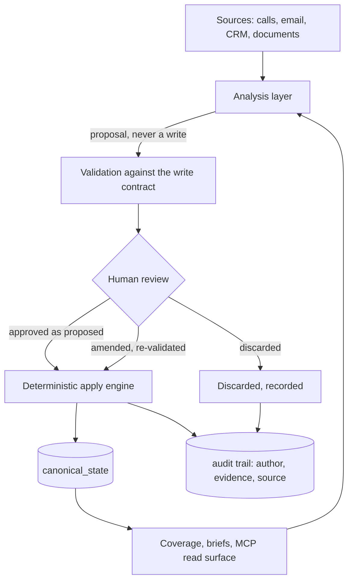

# Tawkshop

**Client management assumes a record of the relationship. That record was designed for humans who could not read fast enough, and it is now the thing holding the work back.**

This repository holds the architecture, the governing principles and the build log. The implementation is private. What follows is the reasoning, which is the part worth arguing about anyway.

If you would rather see what it does than read why it exists, start with [a Tuesday morning](docs/a-tuesday-morning.md), which walks one account through the whole loop.

---

## CRM was built around a human bottleneck

A CRM record is a compression.

An account relationship is hundreds of emails, dozens of calls, a decade of history and a shifting cast of people who want different things and do not all say so. Nobody can hold that in their head before a Tuesday pipeline call. So we built systems that crush it into forty fields: stage, amount, close date, next step, champion, competitor.

Those fields were not chosen to describe reality. They were chosen to serve functions people needed performed. Roll a forecast up. Gate a stage. Fill a board slide. Stage 3 does not tell you anything about the customer; it tells you what your company does with the number. The field set is an interface to a reporting process, and it has been mistaken for a model of the relationship for thirty years.

The compression came with a permanent tax. Someone maintains it by hand, that someone is a seller who would rather be selling, and so it decays. Everyone in enterprise sales knows their CRM is partly fiction. They work around it by keeping the real account knowledge in their head, in their inbox, and in a personal spreadsheet they do not talk about.

## The bottleneck has moved, and the design has not

A language model can read the two hundred emails. It does not need the compression and it does not benefit from it. Hand a capable model forty stale fields and you have given it the lossy summary while withholding the only thing it could actually have used.

So the valuable layer moves. Off the summary, onto the substrate underneath: is the context accurate, is it attributed, is it current, is it structured enough to reason over, and does anyone know when it stopped being true.

Field hygiene used to be a reporting chore that sellers resented. Context quality is now the product.

## Both kinds of context are true

It would be easy to read that as an argument against structured fields. It is not, and getting this wrong in the other direction produces something just as useless.

Every deal is different, and the same deal is different from one month to the next. Who matters changes. The reason it is being bought changes. The thing most likely to kill it changes, usually without anyone announcing that it has. Rich context has to be held in a form that can absorb something nobody anticipated, because what turns out to matter about an account is not knowable when you open it.

But nobody runs a business off narrative. A number has to roll up. A pipeline has to be sorted, weighted and compared. A stage has to mean the same thing across forty deals or the forecast is noise rather than information. The moment you want to compare two accounts, or look at a hundred, you need values that sit in the same place every time. That is what fields are for and there is no substitute for them.

So the mistake was never having fields. It was having only fields, and treating the compression as though it were the record.

What matters is which of the two is derived from which. In a CRM the fields are the record, the real context lives in somebody's head and inbox, and the fields decay because nothing feeds them. Invert that. Hold the evidenced context as the source of truth and derive the reportable fields from it, so a close date stops being a value somebody typed in and becomes the current output of what is actually known, carrying the reason it says what it says and the date that reason was last tested.

Then the roll-up still works, and it means something.

## Reading is solved. Deciding what is true is not.

This is the part that gets skipped, and it is the part the whole system exists to handle.

A model will read the two hundred emails and give you a fluent account of them. What it will not do reliably is tell you which parts are true.

Two stakeholders say different things about the same budget. One is the sponsor, the other actually controls the number, and neither says which. A third repeats in September something the first told them in March, which stopped being true in July, and the model reads the repetition as corroboration. None of that is a comprehension failure. It is a judgement about which source carries weight on which question, and a language model has no principled basis for making it. Ask one directly and it will take the most recent, or the most confident, or blend them into a position nobody actually holds.

Three situations that look identical in the text have to stay distinct:

- one source is right and the other is wrong
- one outranks the other on this question specifically, and not on others
- both are true, because they describe different parts of the organisation, or because the situation changed between them

Collapse those into a single confident answer and you have manufactured certainty, which is worse than a stale CRM field. The stale field at least looks stale.

So the system does not ask a model to adjudicate. It runs a diagnosis.

Every data point is classified by what it is evidence of, measured for whether it is genuinely understood or merely asserted, and scored against what a deal of this shape needs to be true. Conflicts are surfaced as conflicts, carrying both sources, both dates and both positions, and stay open until a person closes them. Gaps are stated rather than filled. Frequently the most useful thing the system produces is a list of what it does not know.

That diagnosis is driven by method rather than by deal shape, which is why it runs across any motion: direct, partner-led, renewal, multi-threaded enterprise. What changes between them is which elements matter and how they are weighted. The mechanics of measuring them do not.

## Meanwhile, the buyers have stopped reading

Almost every sales agent being built today automates the act of selling. Draft the follow-up. Summarise the call. Build the sequence. Log the activity. Chase the prospect.

That bet has a problem it cannot engineer its way out of, and the problem is on the other side of the conversation.

Buyers are saturated. Anyone with a title worth targeting now receives more automated contact than they can process, and they have adapted the only way available to them. They stopped reading. Not selectively, categorically. The test a message has to pass before it gets read is no longer whether it is relevant. It is whether a person actually wrote it.

This is what makes the automation bet self-consuming. Every tool that lowers the cost of sending raises the threshold for responding. The ammunition is free on both sides, so the volume war has no winner and one guaranteed casualty, which is the channel itself. Sequences that worked in 2019 do not fail today because the copy got worse. They fail because the population of senders got larger.

Personalisation at scale does not escape it either. Buyers pattern-match it fluently now, and the tell is not a broken merge field. It is that nothing in the message could only have been written by someone who had genuinely thought about them.

## Which side of the table the model belongs on

The scarce resource has inverted. It used to be seller time, which is why automating the seller made sense. It is now buyer attention, and spending the scarce thing in order to save the abundant one is the wrong way round.

What survives saturation is what always survived it: a conversation worth having. A buyer will still take a call from someone who visibly understands their situation, their constraints, and what happened the last three times they tried to solve this. That has not been automated, and it is not obvious that it can be.

It can be supported, though, and that is where a model earns its place. Not between you and the buyer. Behind you, before the conversation. The model never touches the customer. It makes sure the human who does walks in knowing what is actually true about the account, what is unresolved, who has changed their mind, and what was promised last time by someone who has since left.

**AI belongs on your side of the table, not in the buyer's inbox.**

Which sets the measure of success, and it is not messages sent, fields updated or hours saved. It is whether the next conversation was better than the last one.

**Tawkshop does not sell for you.** It manages the quality of the context that everything else depends on, whether the thing consuming that context is a model, a seller, or the person who inherits the account next quarter.

The same framework is what makes the admin disappear, and that matters more than it sounds. Running a sales cycle properly is a large amount of structured work: qualification, stakeholder mapping, close planning, keeping the record honest enough that the next person can use it. Most of it is necessary and almost none of it is the job. Taking it off a seller's desk returns the hours to the only activity that has ever closed anything, which is talking to people.

People buy from people. That was true when it was a cliché, and it is turning into a differentiator, because buyers have started actively selecting against the alternative. They can tell when they are being handled by a machine, and a growing number treat that as grounds to disqualify a vendor rather than an irritation to tolerate. Pointing AI at the buyer is not merely ineffective now. It is becoming a liability, at the precise moment it is attracting the most investment.

That is a deliberately less exciting product than an agent that books meetings while you sleep. It is also the one that has to exist first.

---

## What follows from that

If context quality is the product, then letting a model write into it unreviewed is self-defeating. So:

**LLMs propose. Humans decide. Deterministic systems apply.**

No model writes to canonical state. There is no configuration flag for it, no trusted-agent mode, no confidence threshold above which it becomes acceptable. A model reads context and returns a proposal. The proposal is validated against a published contract of writable paths and permitted vocabulary, then rendered for a person.

The person has three moves, and the middle one is the common one:

- **Approve as proposed.** The model got it right.
- **Amend, then approve.** The model got the stakeholder right and the date wrong. You fix the date. The amended proposal is re-validated against the same contract, because a human correction is not exempt from the write contract.
- **Discard.** Wrong enough not to be worth repairing. The discard is recorded, because a model that keeps proposing the same discarded thing is telling you something.

Amendment is not a degraded approval. It is the normal shape of review, and it changes who the author is: once a person has corrected a value, that fact was authored by the person, not the model, and the audit trail has to say so. A trail that cannot distinguish the two is not an audit trail.

This is slower than letting the model write, and the trade is obvious once stated: the cost of a wrong close date compounds silently for months, the cost of a review step is measured in seconds.

**Every fact carries its evidence.** Not a confidence score, which is a number a model invented about itself. A quotation long enough that a reader can check the reading without opening the source, or an honest declaration that a person asserted this, or that it was inferred. All three are legitimate. Dressing an inference up as a quotation is not.

**A correction is a supersede, not another write.** A stakeholder leaves, a date moves, a competitor drops out. The old value is superseded and the supersession is recorded. Filing a correction as a plain addition is how a record accumulates contradictions instead of being corrected, which is precisely the failure the system exists to prevent.

**Coverage is measured, not assumed.** The system knows where an account is thin, what has gone stale and what is contested, and it says so before you ask it to reason about that account. A model that does not know what it does not know will confidently fill the gap.

**Every write names its author.** Which sounds too obvious to state. See [the build log](build-log/001-audit-attribution.md) for four months of it not being true.

---

## Built from the sales side, not the IT side

Almost everything in this category is designed from the outside. Engineers and product people model what they observe a sales process to be, then ask sellers to conform to the model. That is how you end up with a stage gate that describes a reporting cadence rather than a customer, and a next-step field that nobody fills in honestly.

This is designed from inside the motion, and the consequence is that the sales method is the data model rather than a layer sitting on top of one.

MEDDPICC is not a scorecard bolted onto a record. The qualification elements are first-class objects that carry their own evidence and go stale on their own terms, because in practice an economic buyer confirmed in March and one confirmed last week are not the same fact. Stakeholders are modelled as people holding positions that move, not as a champion field with one name in it. A partner-led deal gets a second scoring layer, because MEDDPICC alone does not describe a motion where someone else owns the relationship and you are behind them. Knowing that is domain knowledge. It is not an engineering decision and it does not survive being guessed at.

Automation sits on top of that structure rather than substituting for it. A model that can read two hundred emails is only useful if there is somewhere principled to put what it finds. The method supplies the shape, the automation supplies the throughput, and the governance decides what is allowed to land. Remove any one of the three and the other two stop holding.

---

## Shape

Canonical state is organised around Accounts, Contacts and Engagements rather than around opportunities, because the relationship outlives the deal and the deal-shaped record is part of what went wrong. Qualification runs on MEDDPICC, with a second scoring layer for partner-led motions where MEDDPICC alone does not fit.

**Stack:** Python and FastAPI, React and Vite, PostgreSQL on [Supabase](https://supabase.com), an MCP server exposing the read surface and the governed write surface to assistants.

[A Tuesday morning](docs/a-tuesday-morning.md) runs one account through that diagram end to end, which is the fastest way to see what the parts do. The data model and the architecture get their own pages as I write them.

### Why Postgres is doing the load-bearing work

Three of the principles above are database properties before they are anything in application code.

**The hybrid shape.** This is the both-kinds-of-context argument expressed as a schema. Flat columns where the shape is stable and gets queried hard, which is what makes a pipeline sortable and a forecast comparable. JSONB where it is still moving, which is what lets a deal carry something nobody anticipated without a migration. The substrate can then get more structured over time as the shape of a thing settles, rather than being frozen at the first guess about what an account record contains.

**Attribution that commits atomically.** The audit trail lives in the same database as the state it describes, so a value, its evidence and its author land together or not at all. Reconciling those across two systems after the fact produces exactly the defect in build log 001, except harder to find and impossible to repair retrospectively.

**Tenant isolation in the data, not in the queries.** Row-level security is what makes multi-tenancy a property of the database rather than a promise made by application code that has to be correct on every single query. That work is not finished, and it is the part I would most like someone experienced to pick holes in.

Supabase is the reason a single non-engineer has all of that running in production. What the governance model needed was real Postgres rather than an abstraction sitting on top of one: RLS, extensions, proper migrations and a pooler, without an operational surface that would have eaten the hours I had for building. That trade has held. The place it has been tested hardest is the audit table, which is append-only, heavily indexed, and now carries the entire governance argument for the system.

---

## Build log

Things that went wrong, written up properly, including the ones where my first diagnosis was the problem.

- [The column that was never wired](build-log/001-audit-attribution.md). An audit trail that could not name who wrote anything, for four months. I diagnosed it as a regression introduced at a cloud migration, said so in writing, then measured properly and found it had never worked at all. The repair was not a revert. It was wiring a column for the first time.

Next up, and not yet written: the one where my test suite had been writing to production since May, and the residue is permanent because preserved audit history is preserved audit history.

---

## What is here and what is not

Here: architecture, principles, decision records, diagrams, the build log.

Not here: application source, database migrations, prompts, the analysis layer's scoring implementation, and anything touching real customer data. Tawkshop holds live opportunities at named enterprises, so the private repository stays private and nothing is copied out of it.

I would rather say that plainly than publish a hollowed-out repo and leave you to work out what is missing.

---

## Why a salesperson built this

Because the problem is a domain problem wearing an engineering costume, and I had twenty years of the domain and none of the engineering.

That turned out to be a workable trade. I can state precisely what an account record has to be true about, and why thirty years of tooling got it wrong, because I have spent my career working around the consequences. The implementation came from building with AI assistants under a governance model strict enough to survive my not being able to read every line: fix the principles in writing, then hold the build to them. The constitution, the charters and the dated owner rulings are not ceremony. They are how a non-engineer keeps a system honest.

Whether that generalises is an open question, and one of the more interesting ones in this repo.

---

## What I am looking for

**Engineers who want to argue with it.** Particularly anyone who thinks the no-direct-write rule is overcautious, or that context quality is a problem the next model generation dissolves on its own. Open an issue. I would rather be wrong here than in production.

**Someone to build with.** The weak spots are the ones you would predict: multi-tenant security, anything touching performance at scale, and the test discipline that would have stopped the incident in the build log. If that is your territory and the problem interests you, get in touch.

**Sellers and account managers who recognise the problem.** If your pipeline review is thirty minutes of people reciting numbers nobody believes, I want to talk to you.

Issues here, or [LinkedIn](https://www.linkedin.com/in/charles-slicer-watkinson123).

---

*Built by [Charlie Slicer-Watkinson](https://github.com/CSlicer84). Architecture and writing are published under CC BY 4.0. The implementation is not published.*
