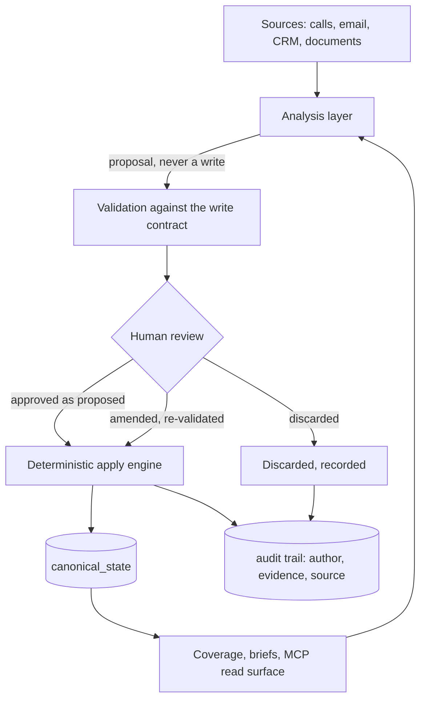

# Tawkshop

Every CRM assumes the record is the relationship. That record was designed for people who couldn't read fast enough, and it's now what's holding the work back.

This repo holds the architecture, the principles and the build log. The implementation is private. If you'd rather see it working than read why it exists, start with [a Tuesday morning](https://github.com/CSlicer84/tawkshop-architecture/blob/main/docs/a-tuesday-morning.md), which takes one account through the whole loop.

## CRM was built around a human bottleneck

An account relationship is hundreds of emails, dozens of calls and a shifting cast of people who want different things (and don't all say so). Nobody can hold that in their head before a pipeline call, so we crushed it into forty fields: stage, amount, close date, next step, champion, competitor.

Those fields were chosen to serve a reporting process (roll up a forecast, gate a stage, fill a board slide), not to describe the customer. Someone has to maintain them by hand, that someone is a seller who'd rather be selling, so the record decays. Everyone in enterprise sales knows their CRM is partly fiction and keeps the real account knowledge in their head and their inbox.

A language model can read the two hundred emails. Hand it forty stale fields and you've given it the lossy summary and withheld the one thing it could actually use. So the value moves to the substrate underneath: is the context accurate, attributed and current, and does anyone know when it stopped being true. Field hygiene used to be a chore sellers resented. Context quality is now the product.

## Fields still matter

None of that is an argument against structured fields. A forecast has to roll up and a stage has to mean the same thing across forty deals, so you need values that sit in the same place every time.

The mistake was having only fields and treating them as the record. Tawkshop inverts it: the evidenced context is the source of truth and the reportable fields are derived from it. A close date stops being something someone typed in and becomes the current output of what's known, with the reason behind it and the date that reason was last tested.

## Reading is solved, deciding what's true isn't

A model will give you a fluent summary of two hundred emails. What it won't do reliably is tell you which parts are true.

Two stakeholders say different things about the same budget. One is the sponsor, the other controls the number, and neither says which. A third repeats in September something that stopped being true in July, and the model reads it as corroboration. That's a judgement about which source carries weight on which question, and a model has no principled basis for making it.

So Tawkshop runs a diagnosis instead of asking a model to adjudicate. Every data point is classified by what it's evidence of, checked for whether it's understood or simply asserted, and scored against what a deal of that shape needs. Conflicts stay open (both sources, both dates) until a person closes them. Gaps are stated rather than filled. Quite often the most useful output is a list of what the system doesn't know.

## AI belongs on the seller's side of the table

Most sales agents being built today automate sending: the follow-up, the sequence, the chase. The problem sits on the buyer's side. Anyone worth targeting gets more automated contact than they can process, so they've stopped reading it, and they spot personalisation at scale easily. Every tool that lowers the cost of sending raises the bar for a reply.

The scarce resource used to be seller time. It's now buyer attention, and spending the scarce thing to save the abundant one is the wrong way round. What still gets through is a conversation worth having, with someone who clearly understands the buyer's situation.

So the model never touches the customer. It works behind the seller, before the conversation, making sure they walk in knowing what's true, what's unresolved, who's changed their mind and what was promised by someone who has since left. The same framework takes the admin off the seller's desk (qualification, stakeholder mapping, close plans, keeping the record honest) and gives those hours back to talking to people. Success is measured by whether the next conversation was better than the last one.

## The rules that follow

If context quality is the product, a model can't write into it unreviewed.

LLMs propose. Humans decide. Deterministic systems apply. No model writes to canonical state, and there's no trusted-agent mode or confidence threshold that changes that. A proposal is validated against a published contract of writable paths and vocabulary, then shown to a person, who can approve it, amend then approve it, or discard it. Amending is the common case. The amended version is re-validated against the same contract and authorship moves to the person, so the audit trail shows who actually decided.

Every fact carries its evidence. A quote long enough to check without opening the source, or an honest declaration that a person asserted it or that it was inferred. All three are fine. Dressing an inference up as a quote isn't.

A correction is a supersede. When a stakeholder leaves or a date moves, the old value is superseded and that's recorded. Filing corrections as new entries is how a record fills up with contradictions.

Coverage is measured. The system knows where an account is thin, stale or contested and says so before reasoning over it.

Every write names its author. Obvious, until [the build log](https://github.com/CSlicer84/tawkshop-architecture/blob/main/build-log/001-audit-attribution.md) shows four months of it not being true.

## Built from the sales side

Most tools in this category are designed from outside the sales motion, then sellers are asked to conform. Here the sales method is the data model. MEDDPICC elements are first-class objects that carry their own evidence and go stale on their own terms (an economic buyer confirmed in March isn't the same fact as one confirmed last week). Stakeholders hold positions that move. Partner-led deals get a second scoring layer, because MEDDPICC alone doesn't describe a motion where someone else owns the relationship.

## Shape

Canonical state is organised around Accounts, Contacts and Engagements rather than opportunities, because the relationship outlives the deal.

Stack: Python/ FastAPI, React/ Vite, PostgreSQL on [Supabase](https://supabase.com/), and an MCP server exposing the read surface and the governed write surface to assistants.

Postgres does most of the heavy lifting. Flat columns where the shape is stable, JSONB where it's still moving, so the schema can firm up over time. The audit trail lives in the same database as the state, so a value, its evidence and its author commit together or not at all. Tenant isolation sits in row-level security rather than in application code; that work isn't finished, and it's the part I'd most like someone experienced to pick holes in. Supabase is the reason one non-engineer has all of that running in production.

## Build log

Things that went wrong, written up properly.

* [The column that was never wired](https://github.com/CSlicer84/tawkshop-architecture/blob/main/build-log/001-audit-attribution.md). An audit trail that couldn't name who wrote anything, for four months. I diagnosed it as a regression from a cloud migration, said so in writing, then measured properly and found it had never worked. The fix was wiring the column for the first time.

## What's not here

Application source, migrations, prompts, the scoring implementation and anything touching customer data. Tawkshop holds live opportunities at named enterprises, so the main repo stays private. I'd rather say that plainly than publish a hollowed-out repo.

## Why a salesperson built this

Because it's a domain problem in an engineering costume, and I had twenty years of the domain and none of the engineering. I built it with AI assistants under a governance model strict enough to survive my not reading every line: principles fixed in writing, and the build held to them. Whether that generalises is one of the more interesting open questions here.

## Get in touch

* Engineers who think the no-direct-write rule is overcautious, or that the next model generation makes context quality irrelevant. Open an issue.
* Someone to build with, particularly on multi-tenant security, performance at scale and test discipline.
* Sellers and account managers whose pipeline review is thirty minutes of reciting numbers nobody believes.

Issues here, or [LinkedIn](https://www.linkedin.com/in/charles-slicer-watkinson123).

Built by [Charlie Slicer-Watkinson](https://github.com/CSlicer84).
